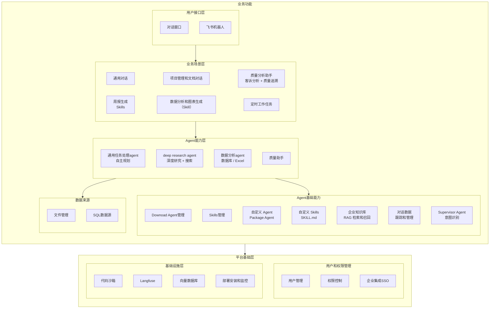

# SunnyAgent v1.0 产品规划

## 产品定位

**制造业智能工作助手** — 面向企业用户的 AI 工作伴侣，提升日常办公效率，实现工作自动化。

---

## 目标用户

| 角色 | 典型场景 | 核心需求 |
|------|----------|----------|
| **质量部人员** | 客诉分析、质量追溯、8D/PDCA 报告 | 快速定位问题根因，关联历史数据 |
| **IT 开发人员** | 技术文档查询、代码辅助、数据处理 | 知识检索、自定义Skils |
| **日常办公人员** | 周报编写、数据汇总、规范查询、设置定时任务 | 提升日常处理效率 |

---

## v1.0 功能架构



**架构说明**：

| 层级 | 说明 |
|------|------|
| **用户接口层** | 用户交互入口，包括 Web 对话窗口和飞书机器人等渠道 |
| **业务场景层** | 面向具体业务场景的解决方案，组合底层 Agent 能力 |
| **Agent 能力层** | 专业化的 Agent，包括通用任务处理、深度研究、数据分析、质量助手等 |
| **Agent 基础能力** | Agent 运行所需的基础能力，包括 Supervisor（意图识别）、Agent/Skills 管理、企业知识库、对话数据管理等 |
| **数据来源** | Agent 可访问的数据源，包括项目级文件管理（含向量化）和通用 SQL 数据源 |
| **平台基础层** | 分为用户权限管理（用户/权限/SSO）和基础设施（沙箱/Langfuse/向量库/部署监控）|

---

## Spec 规划

### 功能支持状态总览

| 层级 | 功能模块 | 状态 | Spec ID |
|------|----------|------|---------|
| **用户接口层** | 对话窗口 | ✅ 已支持 | 001 |
| | 飞书机器人 | 🔲 待开发 | 012 |
| **业务场景层** | 通用对话 | ✅ 已支持 | 001 |
| | 项目管理和文档对话 | 🔲 待开发 | 003 |
| | 定时工作任务 | 🔲 待开发 | 009 |
| | 质量分析助手 | 🔲 待开发 | 005 |
| | 周报生成 (Skills) | 🔲 待开发 | 006 |
| | 数据分析和图表生成 (Skill) | 🔲 待开发 | 004 |
| **Agent 能力层** | 通用任务处理 Agent | ✅ 已支持 | 001 |
| | Deep Research Agent | ✅ 已支持 | 001 |
| | 数据分析 Agent | 🔲 待开发 | 004 |
| | 质量助手 Agent | 🔲 待开发 | 005 |
| **Agent 基础能力** | Download Agent 管理 | 🔲 待开发 | 010 |
| | Skills 管理 | ✅ 部分支持 | 010 |
| | 自定义 Agent (Package) | ✅ 部分支持 | 010 |
| | 自定义 Skills | ✅ 部分支持 | 010 |
| | 企业知识库 (RAG) | 🔲 待开发 | 003 |
| | 对话数据跟踪和管理 | 🔲 待开发 | 013 |
| | Supervisor Agent (意图识别) | ✅ 已支持 | 001/015 |
| **数据来源** | 文件管理 | 🔲 待开发 | 016 |
| | SQL 数据源 | 🔲 待开发 | 017 |
| **用户权限管理** | 用户管理 | ✅ 已支持 | 002 |
| | 权限控制 | ✅ 已支持 | 002 |
| | 企业集成 SSO | 🔲 待开发 | 008 |
| **基础设施层** | 代码沙箱 | ✅ 已支持 | 001 |
| | Langfuse | 🔲 待开发 | 011 |
| | 向量数据库 | 🔲 待开发 | 003 |
| | 部署安装和监控 | 🔲 待开发 | 014 |

### 已完成 Spec

| Spec ID | 模块名称 | 状态 | 说明 |
|---------|----------|------|------|
| **001** | Multi-Agent Chat | ✅ 完成 | 通用对话、Deep Research、General Agent、文件处理、代码沙箱 |
| **002** | 用户与对话管理 | ✅ 完成 | 用户认证、权限控制、对话历史管理 |

### P0 - 核心功能（必须实现）

> 预估工作量基于 **AI 辅助开发**（Claude + 4人并行）

| Spec ID | 模块名称 | 负责人 | 核心功能 | 预估工作量 |
|---------|----------|--------|----------|------------|
| **015** | Supervisor 优化 | 开发者 A | 复杂意图识别、专业术语库、用户画像、路由策略优化 | 5 天 |
| **010** | Agent/Skills 管理 | 开发者 A | Download Agent、在线上传、版本管理、启用/禁用 | 3 天 |
| **016** | 文件管理 | 开发者 B | 项目级文件存储、文件删除、向量化管理 | 3 天 |
| **003** | 企业知识库 | 开发者 B | 向量存储、文档索引、RAG 问答、项目管理和文档对话 | 5 天 |
| **005** | 质量分析助手 | 开发者 B | 客诉分析、质量追溯、8D/PDCA 报告 | 7 天 |
| **017** | SQL 数据源 | 开发者 C | 通用数据源配置、连接管理、直接查询 | 3 天 |
| **004** | 数据分析 Agent | 开发者 C | Excel/CSV 分析、图表生成、数据洞察 | 3 天 |
| **009** | 定时工作任务 | 开发者 C | Cron 调度、触发器、任务队列 | 3 天 |
| **008** | 企业集成 | 开发者 D | SSO 单点登录、企微/钉钉、开放 API | 4 天 |
| **011** | Langfuse 集成 | 开发者 D | Trace 追踪、对话分析、性能监控 | 2 天 |
| **014** | 部署安装和监控 | 开发者 D | 一键部署、系统监控、告警通知 | 3 天 |
| **013** | 对话数据管理 | 开发者 D | 对话数据跟踪、数据集管理、标注和评估 | 3 天 |

**P0 总计**：4人并行约 **2-2.5 周**

### P1 - 重要功能（尽量实现）

| Spec ID | 模块名称 | 所属层级 | 核心功能 | 预估工作量 |
|---------|----------|----------|----------|------------|
| **006** | 周报生成 Skills | 业务场景层 | 周报模板、自动汇总、多格式导出 | 1 天 |
| **012** | 飞书机器人 | 用户接口层 | 飞书消息接入、对话同步 | 2-3 天 |

**P1 总计**：约 3-4 天

---

## 功能详细说明

### 003 - 企业知识库

**目标**：让 AI 能够基于企业内部文档回答问题，支持项目管理和文档对话

**核心能力**：
- 支持 PDF/Word/Excel/PPT/Markdown 文档上传
- 文档自动分块、向量化存储（使用 opensearch和rag）
- RAG（检索增强生成）问答
- 支持按知识库/标签/项目筛选
- 项目文档关联管理
- 支持用户选择文件，和单独的文件进行召回和对话

**典型场景**：
```
用户：IATF 16949 对控制计划有什么要求？
AI：根据您上传的《IATF 16949 标准文档》，控制计划要求包括：
    1. 必须包含所有过程特性和产品特性...
    [引用来源: IATF-16949-2016.pdf, 第8.5.1.1节]
```

```
用户：项目 A 的技术规格书里关于尺寸公差的要求是什么？
AI：根据项目 A 的《技术规格书 v2.1》，尺寸公差要求如下：
    - 外形尺寸：±0.1mm
    - 关键配合尺寸：±0.05mm
    [引用来源: 项目A/技术规格书v2.1.pdf, 第3.2节]
```

### 004 - 数据分析 Agent

**目标**：让 AI 能够智能分析数据并生成可视化图表

**核心能力**：
- 上传 Excel/CSV 自动识别数据结构
- 自然语言查询数据
- 自动生成统计图表（柱状图、折线图、饼图、热力图等）
- 数据异常检测和洞察建议
- 支持数据库连接查询

**典型场景**：
```
用户：分析这份生产数据，找出良率最低的产线和时间段
AI：分析结果：
    - 良率最低产线：L3 产线，平均良率 92.3%
    - 问题时间段：2月第2周，良率骤降至 88.5%
    - 建议关注：该时间段 L3 产线的设备维护记录
    [图表：各产线良率趋势图]
```

```
用户：用柱状图对比各部门本月的销售额
AI：已生成各部门销售额对比图：
    [图表：部门销售额柱状图]
    - 销售一部：¥1,250,000（最高）
    - 销售二部：¥980,000
    - 销售三部：¥850,000
```

### 005 - 质量分析助手

**目标**：辅助质量人员进行客诉分析和质量追溯

**核心能力**：
- 客诉智能分析（解析客诉描述，提取关键信息）
- 质量数据关联（批次→原材料→供应商→生产记录）
- 历史问题检索（相似客诉、同类缺陷）
- 8D/PDCA 报告自动生成

**客诉分析场景**：
```
用户：客户反馈产品 A 批次 20240115 外观不良

AI 分析流程：
1. 解析客诉 → 产品: A, 批次: 20240115, 缺陷类型: 外观不良
2. 追溯生产记录 → 生产日期: 2024-01-14, 产线: L2, 班次: 白班
3. 追溯原材料 → 主材批次: M240110, 供应商: XX公司
4. 检索历史 → 发现同供应商材料有 3 次类似问题记录
5. 生成初步分析报告（含根因假设、建议措施）
```

**质量追溯场景**：
```
用户：追溯产品序列号 SN123456 的完整质量履历

AI 生成追溯报告：
├─ 生产信息: 2024-01-15, L3产线, 订单号 PO2024-0088
├─ 来料检验: 合格, 检验员: 张三, 报告号 IQC-240115-001
├─ 过程检验: 3/3 合格, 关键尺寸 CPK=1.45
├─ 成品检验: 合格, 检验员: 李四, 报告号 FQC-240115-023
└─ 出货信息: 2024-01-16, 客户: ABC公司, 运单号 SF123456
```

### 006 - 周报生成 Skills

**目标**：通过 Skill 自动化生成周报

**核心能力**：
- 周报模板配置（按部门/项目）
- 自动汇总本周工作内容（基于对话历史）
- 多格式导出（Markdown/Word）
- 支持定时自动生成

**典型场景**：
```
用户：/周报
AI：正在生成本周工作周报...

    ## 本周工作汇总（2024.02.05 - 2024.02.09）

    ### 已完成
    1. 完成客诉 #2024-0215 分析，根因已定位
    2. 更新产品 A 检验标准文档
    3. 协助 IT 完成数据导出需求

    ### 进行中
    1. 质量追溯系统优化（进度 60%）

    ### 下周计划
    1. 完成质量追溯系统优化
    2. 准备月度质量报告
```

### 009 - 定时工作任务

**目标**：支持自动化的定时任务执行

**核心能力**：
- 通过自然语言设置定时任务
- 可以在图形界面设置任务
- 任务触发器（时间/事件驱动）
- 任务执行队列管理
- 执行结果通知和推送，支持发送文件

### 011 - Langfuse 集成

**目标**：实现对话质量监控和性能追踪

**核心能力**：
- 对话 Trace 追踪
- Agent 调用链分析
- Token 使用统计
- 性能监控和优化建议

### 012 - 飞书机器人

**目标**：通过飞书机器人提供 AI 对话能力

**核心能力**：
- 飞书消息接入
- 对话上下文同步
- 群聊/私聊支持
- 与 Web 端对话互通

### 013 - 对话数据管理

**目标**：对话数据的跟踪、管理和评估，支持 Agent 持续优化

**核心能力**：
- 对话数据自动采集和存储
- 数据集创建和管理（训练集/测试集）
- 对话质量标注和评分
- 对话效果评估报告
- 数据导出（用于模型微调或分析）

**典型场景**：
```
管理员：创建一个质量分析场景的评估数据集
系统：已创建数据集「质量分析-v1」，当前包含 0 条对话

管理员：将最近 100 条质量分析对话导入数据集
系统：已导入 100 条对话，请对其进行质量标注

管理员：查看本月对话效果报告
系统：本月对话统计：
    - 总对话数：1,234 次
    - 平均满意度：4.2/5
    - 任务完成率：89%
    - 需改进场景：质量追溯（满意度 3.5/5）
```

### 014 - 部署安装和监控

**目标**：简化系统部署流程，提供运行时监控能力

**核心能力**：
- 一键部署脚本（Docker Compose / Kubernetes）
- 系统健康检查和状态监控
- 资源使用统计（CPU/内存/存储）
- 告警通知（邮件/飞书/钉钉）
- 日志集中管理

**典型场景**：
```
运维：部署 SunnyAgent 到生产环境
系统：执行一键部署...
    ✓ 数据库初始化完成
    ✓ 后端服务启动成功
    ✓ 前端服务启动成功
    ✓ 健康检查通过
    部署完成，访问地址：https://sunny.example.com

系统告警：
    ⚠️ CPU 使用率超过 80%
    时间：2024-02-10 14:30
    建议：考虑扩容或优化查询
```

### 015 - Supervisor 优化

**目标**：增强 Supervisor Agent 的复杂意图识别和智能路由能力

**核心能力**：
- 复杂意图识别（支持多意图、模糊意图、专业表达）
- 专业术语库（制造业、质量管理等领域术语）
- 用户画像管理（角色、偏好、历史行为）
- 路由策略优化（基于用户画像和历史对话学习）
- 多轮对话上下文理解
- Agent 选择置信度评估
- 兜底策略和降级处理

**典型场景**：
```
用户：帮我看看上周的生产数据有没有问题
Supervisor 分析：
    - 用户画像：质量部张工，常用数据分析和质量追溯
    - 术语识别：「生产数据」→ 良率/产量/不良率
    - 意图识别：数据分析 + 质量检查
    - 候选 Agent：
      1. 数据分析 Agent（置信度 85%）
      2. 质量助手 Agent（置信度 60%）
    - 决策：路由到数据分析 Agent

用户：CPK 不达标的批次有哪些？
Supervisor 分析：
    - 术语识别：CPK → 过程能力指数（质量术语）
    - 用户画像：质量部人员，熟悉质量术语
    - 意图识别：质量数据查询
    - 决策：路由到质量助手 Agent
```

### 016 - 文件管理

**目标**：支持项目级文件的存储、管理和向量化

**核心能力**：
- 项目级文件存储（按项目/目录组织）
- 文件上传/下载/删除
- 文件版本管理
- 文件向量化（支持 RAG 检索）
- 文件权限控制（项目级/用户级）

**典型场景**：
```
用户：上传产品 A 的技术规格书到项目文档库
系统：已上传「产品A技术规格书v2.1.pdf」
    - 存储位置：项目A/技术文档/
    - 向量化状态：处理中...
    - 向量化完成，可用于 RAG 检索

用户：删除项目 B 中过期的检验标准文档
系统：找到 3 个过期文档：
    1. 检验标准-2022版.pdf
    2. 工艺规范-旧版.docx
    3. SOP-已废弃.pdf
    确认删除？
```

### 017 - SQL 数据源

**目标**：支持通用 SQL 数据源配置和直接查询

**核心能力**：
- 数据源连接配置（MySQL/PostgreSQL/SQL Server 等）
- 连接池管理和健康检查
- 数据源元数据获取（表结构、字段说明）
- 自然语言转 SQL 查询
- 查询结果格式化展示
- 数据源权限控制

**典型场景**：
```
管理员：添加生产数据库连接
系统：请配置数据源：
    - 名称：生产数据库
    - 类型：MySQL
    - 主机：192.168.1.100
    - 端口：3306
    - 数据库：production_db
    连接测试成功，已发现 45 张表

用户：查询本月各产线的良率数据
系统：（连接生产数据库）
    SQL: SELECT line_name, AVG(yield_rate) as avg_yield
         FROM production_data
         WHERE month = '2024-02'
         GROUP BY line_name

    查询结果：
    | 产线 | 平均良率 |
    |------|----------|
    | L1   | 98.5%    |
    | L2   | 97.2%    |
    | L3   | 92.3%    |
```

---

## 技术架构演进

### 当前架构（v0.x - 已实现）

```
用户接口（Web）→ Supervisor → [Research | General] Agent
                                      ↓
                          PostgreSQL (用户/对话/Checkpoints)
                                      ↓
                              代码沙箱 (Docker)
```

### v1.0 目标架构

```
用户接口（Web/飞书）→ Supervisor → [Research | Analysis | Quality | General] Agent
           │                                    ↓
           │                    ┌───────────────────────────┐
           │                    │   Agent 基础能力           │
           │                    │  ┌─────────────────────┐  │
           │                    │  │ 企业知识库 (RAG)     │  │
           │                    │  │ Agent/Skills 管理    │  │
           │                    │  └─────────────────────┘  │
           │                    └───────────────────────────┘
           │                                    ↓
           └──────────→ PostgreSQL + pgvector + Langfuse
```

### 新增技术组件

| 组件 | 用途 | 技术选型 |
|------|------|----------|
| 向量数据库 | 知识库语义检索 | opensearch |
| 文档解析 | 复杂文档内容提取 | unstructured / docling |
| 图表生成 | 数据可视化 | matplotlib / plotly |
| 报告模板 | 文档生成 | python-docx / reportlab |
| Trace 追踪 | 对话质量监控 | Langfuse |
| 对话数据管理 | 数据集管理和评估 | PostgreSQL + 自研 |
| 部署监控 | 系统部署和运维 | Docker Compose / K8s + Prometheus |
| Supervisor 优化 | 意图识别和路由 | LangGraph + 意图分类模型 + 术语库 |
| 文件管理 | 项目级文件存储 | MinIO / S3 + pgvector |
| SQL 数据源 | 通用数据库连接 | SQLAlchemy + 连接池 |
| 飞书集成 | 消息接入 | 飞书开放平台 SDK |

---

## 里程碑计划

### 方案一：单人 + AI 辅助开发

```
        2月W3-W4              3月W1-W2              3月W3-W4              4月W1
           │                    │                    │                    │
           ▼                    ▼                    ▼                    ▼
    ┌────────────┐      ┌────────────┐      ┌────────────┐      ┌────────────┐
    │ M1: 基础   │      │ M2: Agent  │      │ M3: 业务   │      │ M4: 发布   │
    │ 能力建设   │      │ 能力增强   │      │ 场景完善   │      │ + P1功能   │
    └────────────┘      └────────────┘      └────────────┘      └────────────┘
```

**总计**：约 **5-6 周** 完成 v1.0

---

### 方案二：4 人并行 + AI 辅助开发（推荐）

```
Week 1                         Week 2                         Week 3
  │                              │                              │
  ▼                              ▼                              ▼
┌──────────────────────────────────────────────────────────────────────────┐
│ 开发者 A（Agent 架构）                                                    │
├──────────────────────────────────────────────────────────────────────────┤
│ 015-Supervisor优化(5天) ────► 010-Agent/Skills管理(3天) ────► 协助005    │
└──────────────────────────────────────────────────────────────────────────┘
┌──────────────────────────────────────────────────────────────────────────┐
│ 开发者 B（知识库管理）                                                    │
├──────────────────────────────────────────────────────────────────────────┤
│ 016-文件管理(3天) ────► 003-企业知识库(5天) ────► 005-质量分析助手(7天)   │
└──────────────────────────────────────────────────────────────────────────┘
┌──────────────────────────────────────────────────────────────────────────┐
│ 开发者 C（数据分析）                                                      │
├──────────────────────────────────────────────────────────────────────────┤
│ 017-SQL数据源(3天) ────► 004-数据分析Agent(3天) ────► 协助005 + 009定时   │
└──────────────────────────────────────────────────────────────────────────┘
┌──────────────────────────────────────────────────────────────────────────┐
│ 开发者 D（用户权限/基础设施）                                             │
├──────────────────────────────────────────────────────────────────────────┤
│ 008-企业集成SSO(4天) ► 011-Langfuse(2天) ► 014-部署监控(3天) ► 013-数据管理│
└──────────────────────────────────────────────────────────────────────────┘

Week 3 后半周（P1 功能 + 集成测试）
┌──────────────────────────────────────────────────────────────────────────┐
│ 全员：006-周报Skills(1天) + 012-飞书机器人(3天) + 集成测试 + 优化         │
└──────────────────────────────────────────────────────────────────────────┘
```

**4 人分工详情**：

| 角色 | 职责领域 | 负责 Spec | 技能要求 | 工作量 |
|------|----------|-----------|----------|--------|
| **开发者 A** | Agent 架构 | 015, 010 | LangGraph, 意图识别, Agent 调度 | ~8 天 |
| **开发者 B** | 知识库管理 | 016, 003, 005 | RAG, 向量检索, 文件处理 | ~15 天 |
| **开发者 C** | 数据分析 | 017, 004, 009 | SQL, 数据处理, 图表生成 | ~9 天 |
| **开发者 D** | 用户权限/基础设施 | 008, 011, 014, 013 | SSO, DevOps, 监控 | ~12 天 |
| **全员** | P1 + 集成 | 006, 012, 测试 | 协作完成 | ~4 天 |

**依赖关系**：

```
Week 1:
  A: 015-Supervisor ──────────────────────────────┐
  B: 016-文件管理 ► 003-知识库                     │
  C: 017-SQL数据源 ─────────────────────────────┐ │
  D: 008-企业集成SSO                             │ │
                                                 │ │
Week 2:                                          ▼ ▼
  A: 010-Agent管理 ─────────────────────► 协助 005-质量分析
  B: 003-知识库(续) ────────────────────► 005-质量分析助手
  C: 004-数据分析Agent ─────────────────► 协助 005
  D: 011-Langfuse ► 014-部署监控

Week 3:
  B: 005-质量分析助手(主负责)
  A+C: 协助 005 + 009-定时任务
  D: 013-对话数据管理
  全员: P1 功能 + 集成测试
```

**关键节点**：
- **Day 3**：C 完成 017-SQL数据源，解除 005 的数据依赖
- **Day 8**：B 完成 003-知识库，开始 005-质量分析
- **Week 2 末**：A、C 完成主任务，加入协助 005

**总计**：约 **2-2.5 周** 完成 v1.0

---

## 待确认事项

1. **质量数据源**：客诉和质量数据存储在哪里？MES/QMS/ERP/Excel？
2. **知识库内容**：优先上传哪类文档？SOP/检验标准/产品规格？
3. **部署方式**：私有化部署还是 SaaS 模式？
4. **飞书集成**：飞书机器人是否 v1.0 必须？优先级如何？
5. **Langfuse**：是否自建还是使用 SaaS 版本？

---

## Spec 文件结构

> 每个 Spec 由 PM 创建 spec.md，分配给开发者后由开发者生成 plan.md 和 tasks.md

```
specs/
├── 001-multi-agent-chat/              # ✅ 已完成
├── 002-conversation-user-management/  # ✅ 已完成
│
│  # 开发者 A - Agent 架构
├── 015-supervisor-optimization/       # 🔲 开发者 A (5天)
│   ├── spec.md      ← PM 创建
│   ├── plan.md      ← 开发者 A 创建，架构师审核
│   └── tasks.md     ← 开发者 A 创建
├── 010-agent-skills-management/       # 🔲 开发者 A (3天)
│
│  # 开发者 B - 知识库管理
├── 016-file-management/               # 🔲 开发者 B (3天)
├── 003-enterprise-knowledge/          # 🔲 开发者 B (5天)
├── 005-quality-analysis-assistant/    # 🔲 开发者 B (7天)
│
│  # 开发者 C - 数据分析
├── 017-sql-datasource/                # 🔲 开发者 C (3天)
├── 004-data-analysis-agent/           # 🔲 开发者 C (3天)
├── 009-scheduled-tasks/               # 🔲 开发者 C (3天)
│
│  # 开发者 D - 用户权限/基础设施
├── 008-enterprise-integration/        # 🔲 开发者 D (4天)
├── 011-langfuse-integration/          # 🔲 开发者 D (2天)
├── 014-deployment-monitoring/         # 🔲 开发者 D (3天)
├── 013-conversation-data-management/  # 🔲 开发者 D (3天)
│
│  # P1 - 待分配
├── 006-weekly-report-skill/           # 🔲 待分配 (1天)
└── 012-feishu-bot/                    # 🔲 待分配 (3天)
```
