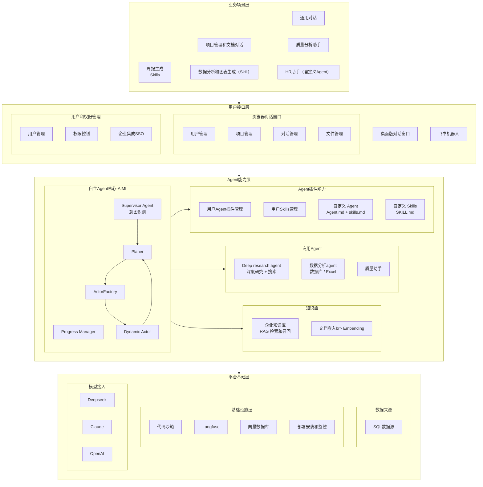

# SunnyAgent v1.0 产品规划

## 产品定位

**制造业智能工作助手** — 面向企业用户的 AI 工作伴侣，提升日常办公效率，实现工作自动化。

---

## 目标用户

| 角色 | 典型场景 | 核心需求 |
|------|----------|----------|
| **质量部人员** | 客诉分析、质量追溯、8D/PDCA 报告 | 快速定位问题根因，关联历史数据 |
| **IT 开发人员** | 技术文档查询、代码辅助、数据处理 | 知识检索、自定义Skils |
| **日常办公人员** | 周报编写、数据汇总、规范查询、设置定时任务 | 提升日常处理效率 |
| **HR** | 周报编写、数据汇总、Offer生成、设置定时任务 | 提升HR系统处理效率 |

---

## v1.0 功能架构



**架构说明**：

| 层级 | 说明 |
|------|------|
| **用户接口层** | 用户交互入口，包括 Web 对话窗口和飞书机器人等渠道 |
| **业务场景层** | 面向具体业务场景的解决方案，组合底层 Agent 能力 |
| **Agent 能力层** | 专业化的 Agent，包括通用任务处理、深度研究、数据分析、质量助手等 |
| **Agent 基础能力** | Agent 运行所需的基础能力，包括 Supervisor（意图识别）、Agent/Skills 管理、企业知识库、对话数据管理等 |
| **数据来源** | Agent 可访问的数据源，包括项目级文件管理（含向量化）和通用 SQL 数据源 |
| **平台基础层** | 分为用户权限管理（用户/权限/SSO）和基础设施（沙箱/Langfuse/向量库/部署监控）|

---

## Spec 规划

### 功能支持状态总览

| 层级 | 功能模块 | 状态 | Spec ID | 优先级 |
|------|----------|------|---------|--------|
| **用户接口层** | 对话窗口 | ✅ 已支持 | 001 | - |
| | 任务执行三层展示 | ✅ 已支持 | 003 | - |
| | 项目管理 (GUI) | 🔲 待开发 | 016 | P1 |
| | 文件管理 (GUI) | 🔲 待开发 | 023 | P1 |
| | 飞书机器人 | 🔲 待开发 | 012 | P4 |
| | 桌面版对话窗口 | 🔲 待开发 | 021 | P5 |
| **业务场景层** | 通用对话 | ✅ 已支持 | 001 | - |
| | 项目管理和文档对话 | 🔲 待开发 | 016/018 | P1/P2 |
| | 定时工作任务 | 🔲 待开发 | 009 | P2 |
| | 质量分析助手 | 🔲 待开发 | 005 | P3 |
| | 周报生成 (Skills) | 🔲 待开发 | 006 | P3 |
| | 数据分析和图表生成 (Skill) | 🔲 待开发 | 019 | P4 |
| | HR 助手 (自定义 Agent) | 🔲 待开发 | 022 | P4 |
| **AIMI Agent 核心** | Supervisor Agent (意图识别) | ✅ 已支持 | 001/015 | P0 |
| | Planner | 🔲 待开发 | 020 | 🔥 P0 |
| | Actor Factory | 🔲 待开发 | 020 | 🔥 P0 |
| | Dynamic Actor | 🔲 待开发 | 020 | 🔥 P0 |
| | Progress Manager | 🔲 待开发 | 020 | 🔥 P0 |
| **Agent 能力层** | 通用任务处理 Agent | ✅ 已支持 | 001 | - |
| | Deep Research Agent | ✅ 已支持 | 001 | - |
| | 数据分析 Agent | 🔲 待开发 | 019 | P4 |
| | 质量助手 Agent | 🔲 待开发 | 005 | P3 |
| **Agent 基础能力** | Skill 管理 | ✅ 部分支持 | 010 | P1 |
| | 对话式 Skill Creator | 🔲 待开发 | 024 | P2 |
| | 自定义 Agent 管理 | ✅ 部分支持 | 025 | P1 |
| | Agent 管理界面 | 🔲 待开发 | 026 | P2 |
| | 企业知识库 (RAG) | 🔲 待开发 | 018 | P3 |
| | 对话数据跟踪和管理 | 🔲 待开发 | 013 | P2 |
| **数据来源** | 项目管理 | 🔲 待开发 | 016 | P1 |
| | 文件管理 | 🔲 待开发 | 023 | P1 |
| | SQL 数据源 | 🔲 待开发 | 017 | P4 |
| **用户权限管理** | 用户管理 | ✅ 已支持 | 002 | - |
| | 权限控制 | ✅ 已支持 | 002 | - |
| | 企业集成 SSO | 🔲 待开发 | 008 | P3 |
| **基础设施层** | 多 LLM 提供商支持 | ✅ 已支持 | 004 | - |
| | 代码沙箱 | ✅ 已支持 | 001 | - |
| | Langfuse | 🔲 待开发 | 011 | P1 |
| | 向量数据库 | 🔲 待开发 | 018 | P3 |
| | 部署安装和监控 | 🔲 待开发 | 014 | P3 |

### 已完成 Spec

| Spec ID | 模块名称 | 状态 | 说明 |
|---------|----------|------|------|
| **001** | Multi-Agent Chat | ✅ 完成 | 通用对话、Deep Research、General Agent、文件处理、代码沙箱 |
| **002** | 用户与对话管理 | ✅ 完成 | 用户认证、权限控制、对话历史管理 |
| **003** | 任务展示模式重设计 | ✅ 完成 | 三层显示结构（思考区/执行区/结果区）、SSE 事件增强、任务树展示 |
| **004** | 统一 LLM 提供商 | ✅ 完成 | 支持 Anthropic/OpenAI/DeepSeek 一键切换，使用 litellm 统一接口 |

### 统一优先级规划

> 预估工作量基于 **AI 辅助开发**（Claude + 4人并行）
>
> ⚠️ **依赖关系说明**：被依赖的模块优先实现，箭头表示依赖方向（A → B 表示 A 依赖 B）

---

#### P0 - 最高优先级：AIMI Agent 核心

> 🔥 **AIMI 是整个系统的智能中枢**，所有 Agent 的规划、执行、协调都依赖它

| Spec ID | 模块名称 | 负责人 | 核心功能 | 预估工作量 | 说明 |
|---------|----------|--------|----------|------------|------|
| **020** | AIMI Agent 核心 | 开发者 A | Planner、ActorFactory、Dynamic Actor、Progress Manager | 7 天 | 自主规划和执行引擎 |
| **015** | Supervisor 优化 | 开发者 A | 意图识别、术语库、路由策略（整合到 AIMI） | 5 天 | 与 020 合并开发 |

**P0 说明**：
- AIMI 核心实现后，系统具备自主规划和动态执行能力
- Supervisor 作为 AIMI 的意图识别层，同步优化
- 工作量：约 **1.5 周**（可与 P1 并行）

---

#### P1 - 高优先级：基础能力层

> 被其他功能依赖，必须尽快完成

| Spec ID | 模块名称 | 负责人 | 核心功能 | 预估工作量 | 被依赖于 |
|---------|----------|--------|----------|------------|----------|
| **016** | 项目管理 | 开发者 B | 项目 CRUD、项目关联文件、项目对话管理 | 3 天 | 018-知识库 |
| **023** | 文件管理 | 开发者 C | 用户上传文件、AI 生成文件、文件向量化 | 3 天 | 018-知识库 |
| **010** | Skill 管理 | 开发者 A | Skill CRUD、版本管理、启用/禁用、Skill 市场 | 2 天 | 024 |
| **025** | 自定义 Agent 管理 | 开发者 A | Agent CRUD、Agent 配置、Agent 启用/禁用 | 2 天 | 026 |
| **011** | Langfuse 集成 | 开发者 D | Trace 追踪、对话分析、性能监控 | 2 天 | 013-数据管理 |

**P1 说明**：
- 可与 P0 并行开发
- 016 和 023 可并行开发，010 和 025 可并行开发
- 工作量：约 **3 天**（4人并行）

---

#### P2 - 中优先级：平台能力层

> 依赖 P1，增强平台能力

| Spec ID | 模块名称 | 负责人 | 核心功能 | 预估工作量 | 依赖 | 被依赖于 |
|---------|----------|--------|----------|------------|------|----------|
| **024** | 对话式 Skill Creator | 开发者 A | 通过对话创建 Skill、Skill 模板、自动生成 SKILL.md | 3 天 | 010 | - |
| **026** | Agent 管理界面 | 开发者 A | 用户 Agent 管理 UI、Agent 配置界面、Agent 测试 | 2 天 | 025 | - |
| **009** | 定时工作任务 | 开发者 C | Cron 调度、触发器、任务队列 | 3 天 | 020 | - |
| **013** | 对话数据管理 | 开发者 D | 数据集管理、标注和评估 | 3 天 | 011 | - |

**P2 说明**：
- 024 依赖 010-Skill 管理，026 依赖 025-自定义 Agent 管理
- 009 依赖 020-AIMI 核心，013 依赖 011-Langfuse
- 工作量：约 **3-5 天**（可并行）

---

#### P3 - 标准优先级：业务场景层

> 依赖 P1+P2，面向最终用户

| Spec ID | 模块名称 | 负责人 | 核心功能 | 预估工作量 | 依赖 |
|---------|----------|--------|----------|------------|------|
| **018** | 企业知识库 | 开发者 B | 向量存储、RAG 问答、项目文档对话 | 5 天 | 016, 023 |
| **005** | 质量分析助手 | 开发者 B | 客诉分析、质量追溯、8D/PDCA 报告 | 7 天 | 018 |
| **008** | 企业集成 | 开发者 D | SSO 单点登录、企微/钉钉 | 4 天 | - |
| **014** | 部署安装和监控 | 开发者 D | 一键部署、系统监控、告警通知 | 3 天 | - |
| **006** | 周报生成 Skills | 待分配 | 周报模板、自动汇总、多格式导出 | 1 天 | 020 |

**P3 说明**：
- 018-知识库 依赖 016-项目管理 和 023-文件管理
- 005-质量分析 依赖 018-知识库
- 工作量：约 **1.5-2 周**（可并行）

---

#### P4 - 扩展功能

> 可选实现，增强用户体验和数据能力

| Spec ID | 模块名称 | 负责人 | 核心功能 | 预估工作量 | 依赖 |
|---------|----------|--------|----------|------------|------|
| **017** | SQL 数据源 | 待分配 | 数据源配置、连接管理、直接查询 | 3 天 | - |
| **019** | 数据分析 Agent | 待分配 | Excel/CSV 分析、图表生成、数据洞察 | 3 天 | 017 |
| **012** | 飞书机器人 | 待分配 | 飞书消息接入、对话同步 | 3 天 | 020 |
| **022** | HR 助手示例 | 待分配 | 自定义 Agent 示例（Offer 生成等） | 2 天 | 010 |

---

#### P5 - 远期规划

> 独立模块，可单独规划

| Spec ID | 模块名称 | 负责人 | 核心功能 | 预估工作量 | 依赖 |
|---------|----------|--------|----------|------------|------|
| **021** | 桌面版对话窗口 | 待分配 | Electron/Tauri 桌面应用 | 5 天 | - |

---

#### 依赖关系图

```
P0 (AIMI核心)              P1 (基础能力)              P2 (平台能力)              P3 (业务场景)
─────────────              ─────────────              ─────────────              ─────────────
                           016-项目管理 ─────────────────────────────────────┬► 018-企业知识库
                                                                             │        │
                           023-文件管理 ─────────────────────────────────────┘        ▼
                                                                                 005-质量分析

020-AIMI核心 ──┬──────────► 010-Skill管理 ──────────► 024-Skill Creator
               │                                                               008-企业集成
               ├──────────► 025-Agent管理 ──────────► 026-Agent管理界面        014-部署监控
               │                                                               006-周报Skills
               ├──────────────────────────────────► 009-定时任务
               │
               │           011-Langfuse ───────────► 013-数据管理
               │
015-Supervisor ─┘ (整合)

P4 (扩展功能):              P5 (远期规划):
017-SQL数据源 ► 019-数据分析  021-桌面版GUI
012-飞书机器人
022-HR助手示例
```

---

#### 时间线总览

```
Week 1                    Week 2                    Week 3                    Week 4+         Week 5+
│                         │                         │                         │               │
├─ P0: AIMI核心 ──────────┼─────────────────────────►
├─ P1: 基础能力 ──────────►
│                         ├─ P2: 平台能力 ───────────►
│                         │                         ├─ P3: 业务场景 ──────────►
│                         │                         │                         ├─ P4: 扩展     │
│                         │                         │                         │               ├─ P5: 桌面版
```

**总计**：4人并行约 **3 周** 完成 v1.0 核心（P0-P3），含 P4 约 4 周，P5 远期规划

---

## 功能详细说明

### 020 - AIMI Agent 核心（最高优先级 🔥）

**目标**：构建自主规划和执行的智能中枢，让系统具备自主完成复杂任务的能力

**核心组件**：

| 组件 | 职责 | 说明 |
|------|------|------|
| **Planner** | 任务规划 | 分析用户意图，拆解为可执行的子任务序列 |
| **ActorFactory** | Agent 创建 | 根据任务类型动态创建或选择合适的 Actor |
| **Dynamic Actor** | 任务执行 | 执行具体任务，支持工具调用和子任务委托 |
| **Progress Manager** | 进度管理 | 跟踪任务执行状态，支持重规划和异常处理 |

**核心能力**：
- 自主任务规划（将复杂任务拆解为子任务 DAG）
- 动态 Actor 选择和创建
- 并行任务执行和协调
- 执行进度跟踪和可视化
- 异常检测和自动重规划
- 任务依赖管理

**架构示意**：
```
用户请求
    │
    ▼
┌─────────────────────────────────────────────────────┐
│                   AIMI Agent 核心                    │
│  ┌─────────────────────────────────────────────┐   │
│  │              Supervisor Agent               │   │
│  │         (意图识别 + 路由决策)                │   │
│  └─────────────────────────────────────────────┘   │
│                        │                           │
│                        ▼                           │
│  ┌─────────────────────────────────────────────┐   │
│  │                 Planner                      │   │
│  │    (任务拆解 + 依赖分析 + 执行计划生成)        │   │
│  └─────────────────────────────────────────────┘   │
│                        │                           │
│          ┌─────────────┼─────────────┐             │
│          ▼             ▼             ▼             │
│  ┌─────────────┐ ┌─────────────┐ ┌─────────────┐   │
│  │ Actor (SQL) │ │Actor(Search)│ │Actor(Custom)│   │
│  └─────────────┘ └─────────────┘ └─────────────┘   │
│          │             │             │             │
│          └─────────────┼─────────────┘             │
│                        ▼                           │
│  ┌─────────────────────────────────────────────┐   │
│  │            Progress Manager                  │   │
│  │     (状态跟踪 + 重规划 + 结果汇总)            │   │
│  └─────────────────────────────────────────────┘   │
└─────────────────────────────────────────────────────┘
                        │
                        ▼
                   最终结果
```

**典型场景**：
```
用户：分析最近三个月的质量数据，找出良率最低的产线，并生成改善报告

AIMI 执行流程：
1. Supervisor 识别意图 → 复杂分析任务，路由到 Planner
2. Planner 生成执行计划：
   ├─ 任务1: 查询质量数据库（SQL Agent）
   ├─ 任务2: 数据分析和可视化（Data Agent）- 依赖任务1
   └─ 任务3: 生成改善报告（General Agent）- 依赖任务2
3. ActorFactory 创建对应 Actor
4. Dynamic Actor 并行/串行执行任务
5. Progress Manager 跟踪进度，前端实时展示
6. 汇总结果返回用户
```

**与现有系统集成**：
- 复用 Supervisor Agent 作为入口（015-Supervisor 优化）
- 复用现有 Research/SQL/General Agent 作为 Actor
- 与 003-任务展示 无缝对接（todos_updated 事件）

---

### 018 - 企业知识库（原 003）

**目标**：让 AI 能够基于企业内部文档回答问题，支持项目管理和文档对话

**核心能力**：
- 支持 PDF/Word/Excel/PPT/Markdown 文档上传
- 文档自动分块、向量化存储（使用 opensearch和rag）
- RAG（检索增强生成）问答
- 支持按知识库/标签/项目筛选
- 项目文档关联管理
- 支持用户选择文件，和单独的文件进行召回和对话

**典型场景**：
```
用户：IATF 16949 对控制计划有什么要求？
AI：根据您上传的《IATF 16949 标准文档》，控制计划要求包括：
    1. 必须包含所有过程特性和产品特性...
    [引用来源: IATF-16949-2016.pdf, 第8.5.1.1节]
```

```
用户：项目 A 的技术规格书里关于尺寸公差的要求是什么？
AI：根据项目 A 的《技术规格书 v2.1》，尺寸公差要求如下：
    - 外形尺寸：±0.1mm
    - 关键配合尺寸：±0.05mm
    [引用来源: 项目A/技术规格书v2.1.pdf, 第3.2节]
```

### 019 - 数据分析 Agent（原 004）

**目标**：让 AI 能够智能分析数据并生成可视化图表

**核心能力**：
- 上传 Excel/CSV 自动识别数据结构
- 自然语言查询数据
- 自动生成统计图表（柱状图、折线图、饼图、热力图等）
- 数据异常检测和洞察建议
- 支持数据库连接查询

**典型场景**：
```
用户：分析这份生产数据，找出良率最低的产线和时间段
AI：分析结果：
    - 良率最低产线：L3 产线，平均良率 92.3%
    - 问题时间段：2月第2周，良率骤降至 88.5%
    - 建议关注：该时间段 L3 产线的设备维护记录
    [图表：各产线良率趋势图]
```

```
用户：用柱状图对比各部门本月的销售额
AI：已生成各部门销售额对比图：
    [图表：部门销售额柱状图]
    - 销售一部：¥1,250,000（最高）
    - 销售二部：¥980,000
    - 销售三部：¥850,000
```

### 005 - 质量分析助手

**目标**：辅助质量人员进行客诉分析和质量追溯

**核心能力**：
- 客诉智能分析（解析客诉描述，提取关键信息）
- 质量数据关联（批次→原材料→供应商→生产记录）
- 历史问题检索（相似客诉、同类缺陷）
- 8D/PDCA 报告自动生成

**客诉分析场景**：
```
用户：客户反馈产品 A 批次 20240115 外观不良

AI 分析流程：
1. 解析客诉 → 产品: A, 批次: 20240115, 缺陷类型: 外观不良
2. 追溯生产记录 → 生产日期: 2024-01-14, 产线: L2, 班次: 白班
3. 追溯原材料 → 主材批次: M240110, 供应商: XX公司
4. 检索历史 → 发现同供应商材料有 3 次类似问题记录
5. 生成初步分析报告（含根因假设、建议措施）
```

**质量追溯场景**：
```
用户：追溯产品序列号 SN123456 的完整质量履历

AI 生成追溯报告：
├─ 生产信息: 2024-01-15, L3产线, 订单号 PO2024-0088
├─ 来料检验: 合格, 检验员: 张三, 报告号 IQC-240115-001
├─ 过程检验: 3/3 合格, 关键尺寸 CPK=1.45
├─ 成品检验: 合格, 检验员: 李四, 报告号 FQC-240115-023
└─ 出货信息: 2024-01-16, 客户: ABC公司, 运单号 SF123456
```

### 006 - 周报生成 Skills

**目标**：通过 Skill 自动化生成周报

**核心能力**：
- 周报模板配置（按部门/项目）
- 自动汇总本周工作内容（基于对话历史）
- 多格式导出（Markdown/Word）
- 支持定时自动生成

**典型场景**：
```
用户：/周报
AI：正在生成本周工作周报...

    ## 本周工作汇总（2024.02.05 - 2024.02.09）

    ### 已完成
    1. 完成客诉 #2024-0215 分析，根因已定位
    2. 更新产品 A 检验标准文档
    3. 协助 IT 完成数据导出需求

    ### 进行中
    1. 质量追溯系统优化（进度 60%）

    ### 下周计划
    1. 完成质量追溯系统优化
    2. 准备月度质量报告
```

### 009 - 定时工作任务

**目标**：支持自动化的定时任务执行

**核心能力**：
- 通过自然语言设置定时任务
- 可以在图形界面设置任务
- 任务触发器（时间/事件驱动）
- 任务执行队列管理
- 执行结果通知和推送，支持发送文件

### 011 - Langfuse 集成

**目标**：实现对话质量监控和性能追踪

**核心能力**：
- 对话 Trace 追踪
- Agent 调用链分析
- Token 使用统计
- 性能监控和优化建议

### 012 - 飞书机器人

**目标**：通过飞书机器人提供 AI 对话能力

**核心能力**：
- 飞书消息接入
- 对话上下文同步
- 群聊/私聊支持
- 与 Web 端对话互通

### 013 - 对话数据管理

**目标**：对话数据的跟踪、管理和评估，支持 Agent 持续优化

**核心能力**：
- 对话数据自动采集和存储
- 数据集创建和管理（训练集/测试集）
- 对话质量标注和评分
- 对话效果评估报告
- 数据导出（用于模型微调或分析）

**典型场景**：
```
管理员：创建一个质量分析场景的评估数据集
系统：已创建数据集「质量分析-v1」，当前包含 0 条对话

管理员：将最近 100 条质量分析对话导入数据集
系统：已导入 100 条对话，请对其进行质量标注

管理员：查看本月对话效果报告
系统：本月对话统计：
    - 总对话数：1,234 次
    - 平均满意度：4.2/5
    - 任务完成率：89%
    - 需改进场景：质量追溯（满意度 3.5/5）
```

### 014 - 部署安装和监控

**目标**：简化系统部署流程，提供运行时监控能力

**核心能力**：
- 一键部署脚本（Docker Compose / Kubernetes）
- 系统健康检查和状态监控
- 资源使用统计（CPU/内存/存储）
- 告警通知（邮件/飞书/钉钉）
- 日志集中管理

**典型场景**：
```
运维：部署 SunnyAgent 到生产环境
系统：执行一键部署...
    ✓ 数据库初始化完成
    ✓ 后端服务启动成功
    ✓ 前端服务启动成功
    ✓ 健康检查通过
    部署完成，访问地址：https://sunny.example.com

系统告警：
    ⚠️ CPU 使用率超过 80%
    时间：2024-02-10 14:30
    建议：考虑扩容或优化查询
```

### 015 - Supervisor 优化

**目标**：增强 Supervisor Agent 的复杂意图识别和智能路由能力

**核心能力**：
- 复杂意图识别（支持多意图、模糊意图、专业表达）
- 专业术语库（制造业、质量管理等领域术语）
- 用户画像管理（角色、偏好、历史行为）
- 路由策略优化（基于用户画像和历史对话学习）
- 多轮对话上下文理解
- Agent 选择置信度评估
- 兜底策略和降级处理

**典型场景**：
```
用户：帮我看看上周的生产数据有没有问题
Supervisor 分析：
    - 用户画像：质量部张工，常用数据分析和质量追溯
    - 术语识别：「生产数据」→ 良率/产量/不良率
    - 意图识别：数据分析 + 质量检查
    - 候选 Agent：
      1. 数据分析 Agent（置信度 85%）
      2. 质量助手 Agent（置信度 60%）
    - 决策：路由到数据分析 Agent

用户：CPK 不达标的批次有哪些？
Supervisor 分析：
    - 术语识别：CPK → 过程能力指数（质量术语）
    - 用户画像：质量部人员，熟悉质量术语
    - 意图识别：质量数据查询
    - 决策：路由到质量助手 Agent
```

### 016 - 项目管理

**目标**：支持项目 CRUD、项目关联文件、项目对话管理

**核心能力**：
- 项目 CRUD（创建、查询、更新、删除）
- 项目成员管理（添加/移除成员）
- 项目配置（名称、描述、标签）
- 项目列表和搜索
- 项目关联文件（关联已上传的文件到项目）
- 项目对话管理（项目范围内的对话历史）
- 项目权限控制

**典型场景**：
```
用户：创建一个新项目「产品A质量改善」
系统：已创建项目「产品A质量改善」
    - 项目 ID：proj-2024-001
    - 创建者：张工
    - 成员：张工、李工、王工

用户：把「技术规格书v2.1.pdf」关联到项目
系统：已将文件关联到项目「产品A质量改善」
    - 文件可用于项目范围内的 RAG 检索

用户：查看项目「产品A质量改善」的对话历史
系统：该项目共有 15 条对话记录：
    - 2024-02-10: 质量数据分析
    - 2024-02-09: 客诉问题追溯
    - ...
```

---

### 023 - 文件管理

**目标**：管理用户上传文件和 AI 生成文件

**核心能力**：
- 用户文件上传/下载/删除
- AI 生成文件管理（报告、图表、代码等）
- 文件版本管理
- 文件向量化（支持 RAG 检索）
- 文件预览（PDF、图片、文本等）
- 文件权限控制（用户级）
- 文件标签和分类

**典型场景**：
```
用户：上传产品 A 的技术规格书
系统：已上传「产品A技术规格书v2.1.pdf」
    - 文件大小：2.3 MB
    - 向量化状态：处理中...
    - 向量化完成，可用于 RAG 检索

AI：已生成质量分析报告
系统：报告已保存到「我的文件」
    - 文件名：质量分析报告_20240210.pdf
    - 来源：AI 生成
    - 可下载或关联到项目

用户：删除过期的检验标准文档
系统：找到 3 个匹配文档：
    1. 检验标准-2022版.pdf
    2. 工艺规范-旧版.docx
    3. SOP-已废弃.pdf
    确认删除？
```

---

### 010 - Skill 管理

**目标**：管理系统和用户创建的 Skill

**核心能力**：
- Skill CRUD（创建、查询、更新、删除）
- Skill 版本管理
- Skill 启用/禁用
- Skill 市场（浏览、搜索、安装）
- Skill 权限控制（系统级/用户级）
- Skill 导入/导出

**典型场景**：
```
用户：查看可用的 Skills
系统：当前可用 Skills：
    - /周报 - 自动生成周报 [系统]
    - /数据分析 - 分析 Excel/CSV [系统]
    - /客诉分析 - 质量客诉分析 [自定义]

用户：禁用「客诉分析」Skill
系统：已禁用 Skill「客诉分析」
    - 该 Skill 将不再出现在可用列表中
    - 可随时重新启用
```

---

### 024 - 对话式 Skill Creator

**目标**：通过对话方式创建自定义 Skill

**核心能力**：
- 对话式 Skill 创建向导
- Skill 模板库
- 自动生成 SKILL.md
- Skill 参数配置
- Skill 测试和预览
- Skill 发布到市场

**典型场景**：
```
用户：我想创建一个 Skill 来生成采购申请单
AI：好的，让我帮你创建这个 Skill。请告诉我：
    1. Skill 名称是什么？
    2. 需要哪些输入参数？（如物料名称、数量等）
    3. 输出格式是什么？

用户：名称叫「采购申请」，需要物料名称、数量、申请理由，输出 Word 格式

AI：已为你创建 Skill「采购申请」：
    - 触发命令：/采购申请
    - 输入参数：物料名称、数量、申请理由
    - 输出格式：Word 文档

    是否需要测试一下？

用户：测试一下

AI：请提供测试数据...
    [生成预览]
    Skill 测试成功！是否发布？
```

---

### 025 - 自定义 Agent 管理

**目标**：管理用户创建的自定义 Agent

**核心能力**：
- Agent CRUD（创建、查询、更新、删除）
- Agent 配置（系统提示、工具、模型等）
- Agent 启用/禁用
- Agent 版本管理
- Agent 权限控制
- Agent 导入/导出（AGENTS.md）

**典型场景**：
```
用户：创建一个「HR 助手」Agent
系统：请配置 Agent：
    - 名称：HR 助手
    - 描述：处理 HR 相关任务
    - 系统提示：你是一个专业的 HR 助手...
    - 可用工具：文档生成、数据查询
    - 关联 Skills：/周报、/Offer生成

用户：查看我的自定义 Agents
系统：你创建的 Agents：
    - HR 助手 [启用] - 处理 HR 相关任务
    - 质量分析员 [启用] - 质量数据分析
    - 测试 Agent [禁用] - 测试用
```

---

### 026 - Agent 管理界面

**目标**：提供用户友好的 Agent 管理 UI

**核心能力**：
- Agent 列表展示（卡片/列表视图）
- Agent 配置可视化编辑
- Agent 测试对话界面
- Agent 使用统计
- Agent 版本对比
- 拖拽式工具配置

**界面示意**：
```
┌─────────────────────────────────────────────────────────────┐
│  我的 Agents                              [+ 创建 Agent]    │
├─────────────────────────────────────────────────────────────┤
│  ┌─────────────┐  ┌─────────────┐  ┌─────────────┐         │
│  │ 🤖 HR 助手  │  │ 📊 质量分析 │  │ 📝 周报助手 │         │
│  │             │  │             │  │             │         │
│  │ ✅ 启用     │  │ ✅ 启用     │  │ ⚪ 禁用     │         │
│  │ 调用: 156次 │  │ 调用: 89次  │  │ 调用: 0次   │         │
│  │             │  │             │  │             │         │
│  │ [编辑][测试]│  │ [编辑][测试]│  │ [编辑][启用]│         │
│  └─────────────┘  └─────────────┘  └─────────────┘         │
└─────────────────────────────────────────────────────────────┘
```

---

### 017 - SQL 数据源

**目标**：支持通用 SQL 数据源配置和直接查询

**核心能力**：
- 数据源连接配置（MySQL/PostgreSQL/SQL Server 等）
- 连接池管理和健康检查
- 数据源元数据获取（表结构、字段说明）
- 自然语言转 SQL 查询
- 查询结果格式化展示
- 数据源权限控制

**典型场景**：
```
管理员：添加生产数据库连接
系统：请配置数据源：
    - 名称：生产数据库
    - 类型：MySQL
    - 主机：192.168.1.100
    - 端口：3306
    - 数据库：production_db
    连接测试成功，已发现 45 张表

用户：查询本月各产线的良率数据
系统：（连接生产数据库）
    SQL: SELECT line_name, AVG(yield_rate) as avg_yield
         FROM production_data
         WHERE month = '2024-02'
         GROUP BY line_name

    查询结果：
    | 产线 | 平均良率 |
    |------|----------|
    | L1   | 98.5%    |
    | L2   | 97.2%    |
    | L3   | 92.3%    |
```

---

## 技术架构演进

### 当前架构（v0.x - 已实现）

```
用户接口（Web）→ Supervisor → [Research | General] Agent
                                      ↓
                          PostgreSQL (用户/对话/Checkpoints)
                                      ↓
                              代码沙箱 (Docker)
```

### v1.0 目标架构

```
用户接口（Web/飞书）→ Supervisor → [Research | Analysis | Quality | General] Agent
           │                                    ↓
           │                    ┌───────────────────────────┐
           │                    │   Agent 基础能力           │
           │                    │  ┌─────────────────────┐  │
           │                    │  │ 企业知识库 (RAG)     │  │
           │                    │  │ Agent/Skills 管理    │  │
           │                    │  └─────────────────────┘  │
           │                    └───────────────────────────┘
           │                                    ↓
           └──────────→ PostgreSQL + pgvector + Langfuse
```

### 新增技术组件

| 组件 | 用途 | 技术选型 |
|------|------|----------|
| 向量数据库 | 知识库语义检索 | opensearch |
| 文档解析 | 复杂文档内容提取 | unstructured / docling |
| 图表生成 | 数据可视化 | matplotlib / plotly |
| 报告模板 | 文档生成 | python-docx / reportlab |
| Trace 追踪 | 对话质量监控 | Langfuse |
| 对话数据管理 | 数据集管理和评估 | PostgreSQL + 自研 |
| 部署监控 | 系统部署和运维 | Docker Compose / K8s + Prometheus |
| Supervisor 优化 | 意图识别和路由 | LangGraph + 意图分类模型 + 术语库 |
| 文件管理 | 项目级文件存储 | MinIO / S3 + pgvector |
| SQL 数据源 | 通用数据库连接 | SQLAlchemy + 连接池 |
| 飞书集成 | 消息接入 | 飞书开放平台 SDK |

---

## 里程碑计划

### 方案一：单人 + AI 辅助开发

```
        2月W3-W4              3月W1-W2              3月W3-W4              4月W1
           │                    │                    │                    │
           ▼                    ▼                    ▼                    ▼
    ┌────────────┐      ┌────────────┐      ┌────────────┐      ┌────────────┐
    │ M1: 基础   │      │ M2: Agent  │      │ M3: 业务   │      │ M4: 发布   │
    │ 能力建设   │      │ 能力增强   │      │ 场景完善   │      │ + P1功能   │
    └────────────┘      └────────────┘      └────────────┘      └────────────┘
```

**总计**：约 **5-6 周** 完成 v1.0

---

### 方案二：4 人并行 + AI 辅助开发（推荐）

```
Week 1                         Week 2                         Week 3                    Week 4+
  │                              │                              │                         │
  ▼                              ▼                              ▼                         ▼
┌─────────────────────────────────────────────────────────────────────────────────────────────────┐
│ 开发者 A（AIMI 核心 + Agent/Skill）🔥 关键路径                                                   │
├─────────────────────────────────────────────────────────────────────────────────────────────────┤
│ 020-AIMI核心(7天)+015-Supervisor(5天) ► 010-Skill(2天)+025-Agent(2天) ► 024-Creator+026-UI(5天)│
└─────────────────────────────────────────────────────────────────────────────────────────────────┘
┌─────────────────────────────────────────────────────────────────────────────────────────────────┐
│ 开发者 B（项目/知识库管理）                                                                      │
├─────────────────────────────────────────────────────────────────────────────────────────────────┤
│ 016-项目管理(3天) ────► 018-企业知识库(5天) ────► 005-质量分析助手(7天) ────────────────────────► │
└─────────────────────────────────────────────────────────────────────────────────────────────────┘
┌─────────────────────────────────────────────────────────────────────────────────────────────────┐
│ 开发者 C（文件管理 + 定时任务）                                                                   │
├─────────────────────────────────────────────────────────────────────────────────────────────────┤
│ 023-文件管理(3天) ────► 009-定时任务(3天) ────► 协助018/005 ────► [P4] 017-SQL ► 019-数据分析   │
└─────────────────────────────────────────────────────────────────────────────────────────────────┘
┌─────────────────────────────────────────────────────────────────────────────────────────────────┐
│ 开发者 D（基础设施 + 运维）                                                                      │
├─────────────────────────────────────────────────────────────────────────────────────────────────┤
│ 011-Langfuse(2天) ► 013-数据管理(3天) ► 008-企业集成(4天) ► 014-部署监控(3天) ► 006-周报         │
└─────────────────────────────────────────────────────────────────────────────────────────────────┘

Week 4+（P4 功能 + 集成测试）
┌─────────────────────────────────────────────────────────────────────────────────────────────────┐
│ 全员：012-飞书机器人(3天) + 集成测试 + 优化 + 文档                                                │
└─────────────────────────────────────────────────────────────────────────────────────────────────┘
```

**4 人分工详情**：

| 角色 | 职责领域 | 负责 Spec | 技能要求 | 工作量 |
|------|----------|-----------|----------|--------|
| **开发者 A** | 🔥 AIMI 核心 + Agent/Skill | 020, 015, 010, 025, 024, 026 | LangGraph, 规划算法, Agent 调度 | ~19 天 |
| **开发者 B** | 项目/知识库管理 | 016, 018, 005 | RAG, 向量检索, 项目管理 | ~15 天 |
| **开发者 C** | 文件管理 + 定时任务 | 023, 009, 017(P4), 019(P4) | 文件处理, 调度系统, SQL | ~6 天 (核心) + 6 天 (P4) |
| **开发者 D** | 基础设施 + 运维 | 011, 014, 008, 013, 006 | DevOps, 监控, SSO | ~13 天 |
| **全员** | P4 + 集成 | 012, 测试 | 协作完成 | ~4 天 |

**依赖关系**：

```
Week 1（P0 AIMI核心 + P1 基础能力）:
  A: 🔥 020-AIMI核心 ────────────────────────────────────────┐
  B: 016-项目管理 ────────────────────────────────────────┐  │
  C: 023-文件管理 ────────────────────────────────────┐  │  │
  D: 011-Langfuse ────────────────────────────────┐   │  │  │
                                                   │   │  │  │
Week 2（P0续 + P2 平台能力层）:                     │   │  │  │
  A: 020(续) + 015-Supervisor + 010-Skill + 025-Agent──┼──┼──┤
  B: 协助其他模块                                   │   │  │  │
  C: 009-定时任务 ◄────────────────────────────────┘   │  │  │
  D: 013-数据管理 ◄────────────────────────────────────┘  │  │
                                                          │  │
Week 3（P2续 + P3 业务场景）:                              ▼  ▼
  A: 024-Skill Creator + 026-Agent界面
  B: 018-知识库 ◄─────────────────────────────────────────┴──┘
  C: 协助 018/005
  D: 008-企业集成 ► 014-部署监控

Week 4（P3续）:
  A: 协助 005
  B: 005-质量分析助手
  C: 协助 005
  D: 006-周报 + 集成测试

Week 5+（P4 扩展功能 - 可选）:
  C: 017-SQL数据源 ► 019-数据分析Agent
  全员: 012-飞书机器人 + 集成测试 + 优化

P5（远期规划）:
  待定: 021-桌面版GUI
```

**关键节点**：
- **Day 7**：A 完成 020-AIMI 核心基础版本，系统具备自主规划能力
- **Day 10**：A 完成 015-Supervisor 优化 + P1 Agent/Skill 管理
- **Day 3**：B 完成 016-项目管理，C 完成 023-文件管理
- **Day 6**：D 完成 011-Langfuse + 013-对话数据管理
- **Week 3**：B 开始 018-知识库，A 完成 P2 Skill/Agent 增强
- **Week 4 末**：所有 P0-P3 核心功能完成

**总计**：约 **3-4 周** 完成 v1.0 核心（P0-P3），含 P4 约 5 周

---

## 待确认事项

1. **质量数据源**：客诉和质量数据存储在哪里？MES/QMS/ERP/Excel？
2. **知识库内容**：优先上传哪类文档？SOP/检验标准/产品规格？
3. **部署方式**：私有化部署还是 SaaS 模式？
4. **飞书集成**：飞书机器人是否 v1.0 必须？优先级如何？
5. **Langfuse**：是否自建还是使用 SaaS 版本？

---

## Spec 文件结构

> 每个 Spec 由 PM 创建 spec.md，分配给开发者后由开发者生成 plan.md 和 tasks.md

```
specs/
│  # ✅ 已完成
├── 001-multi-agent-chat/              # ✅ 已完成 - 基础对话、Agent、沙箱
├── 002-conversation-user-management/  # ✅ 已完成 - 用户认证、对话管理
├── 003-task-display/                  # ✅ 已完成 - 三层展示、SSE 增强
├── 004-unified-llm-provider/          # ✅ 已完成 - 多 LLM 提供商支持
│
│  # P0 - 最高优先级：AIMI Agent 核心
├── 020-aimi-agent-core/               # 🔥 开发者 A (7天) - 自主规划执行引擎
│   # Planner, ActorFactory, Dynamic Actor, Progress Manager
├── 015-supervisor-optimization/       # 🔥 开发者 A (5天) - 与 020 合并开发
│
│  # P1 - 高优先级：基础能力层
├── 016-project-management/            # 🔲 开发者 B (3天) - 项目 CRUD、项目关联、项目对话
├── 023-file-management/               # 🔲 开发者 C (3天) - 用户文件、AI 生成文件、向量化
├── 010-skill-management/              # 🔲 开发者 A (2天) - Skill CRUD、版本管理、启用/禁用
├── 025-custom-agent-management/       # 🔲 开发者 A (2天) - Agent CRUD、配置、启用/禁用
├── 011-langfuse-integration/          # 🔲 开发者 D (2天) - 被 013 依赖
│
│  # P2 - 中优先级：平台能力层
├── 024-skill-creator/                 # 🔲 开发者 A (3天) - 对话式创建 Skill，依赖 010
├── 026-agent-management-ui/           # 🔲 开发者 A (2天) - Agent 管理界面，依赖 025
├── 009-scheduled-tasks/               # 🔲 开发者 C (3天) - 定时任务，依赖 020
├── 013-conversation-data-management/  # 🔲 开发者 D (3天) - 对话数据管理，依赖 011
│
│  # P3 - 标准优先级：业务场景层
├── 018-enterprise-knowledge/          # 🔲 开发者 B (5天) - 企业知识库，依赖 016, 023
├── 005-quality-analysis-assistant/    # 🔲 开发者 B (7天) - 依赖 018
├── 008-enterprise-integration/        # 🔲 开发者 D (4天) - 独立
├── 014-deployment-monitoring/         # 🔲 开发者 D (3天) - 独立
├── 006-weekly-report-skill/           # 🔲 待分配 (1天) - 依赖 020
│
│  # P4 - 扩展功能（可选）
├── 017-sql-datasource/                # 🔲 待分配 (3天) - SQL 数据源
├── 019-data-analysis-agent/           # 🔲 待分配 (3天) - 依赖 017
├── 012-feishu-bot/                    # 🔲 待分配 (3天) - 依赖 020
├── 022-hr-assistant-example/          # 📋 待规划 (2天) - 自定义 Agent 示例
│
│  # P5 - 远期规划
└── 021-desktop-gui/                   # 📋 待规划 (5天) - 桌面版应用
```
